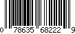
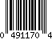
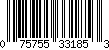
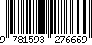

# Barcode Decoder

PyATL Jam Session — Sept. 5th, 2019

For a pretty version of this document, go to:
https://github.com/pyatl/jam-sessions/blob/master/2019-09/README.md

## Outline

* [Introduction](#introduction)
* [1. Decoding the left digits](#1-decoding-the-left-digits)
* [2. Decoding the right digits](#2-decoding-the-right-digits)
* [3. UPC-A Decoding](#3-upc-a-decoding)
* [4. UPC-A Checksum Verification](#4-upc-a-checksum-verification)
* [5. EAN-13 Decoding](#5-ean-13-decoding)
* [Extra Challenges](#extra-challenges)

## Introduction

You probably know what a [barcode] looks like, and use it daily. In this exercise, we will be writing code that can convert the sequence of bars and spaces into the data it represents.



For most products sold in the USA, barcodes follow the UPC (Universal Product Code) specification (or _symbology_). Visually, a UPC barcode looks like a series of bars of various widths, and the spaces between those bars also vary in width. This is actually a binary code that represents a number.

A UPC barcode can be divided into sections (_blocks_) of equal width. We will be representing a block occupied by a bar with 1, and one occupied by a space with 0.

Consequently, the barcode below can be modeled by:



    101001110100010110110011011001101110110001101010101

In the first and second parts of the exercise, we will write code for decoding sequences of 7 blocks into digits. In the third part, we will use that knowledge to read full [UPC-A] codes. In the fourth part, we will check their validity using checksums. In the fifth and final part, we will be expanding our UPC-A decoder to the broader [EAN-13] symbology using parity decoding.

### Challenge instructions

First, join the online Cyber-Dojo session:

1. Go to <https://www.cyber-dojo.org/>
2. Select "We're in a group", then "Join a session"
3. Enter the ID that will be shared with the group at the time of the meeting, or on the Meetup page directly.
4. An animal will be assigned to you, then you will be able to start coding on the next page.

On the Cyber-dojo interface, you will see:

* The editor (middle / bottom-right), which occupies most of the page and is where you will be coding.
* The list of files (on the left):
  * `barcode.py` is where you should write your code, and contains a very bare stub of functions at the start.
  * `test_barcode.py` contains the tests for the challenge. All the examples in here are already in it, however you are free to modify them if you wish to.
* Your test run history (top bar of the page), which will be empty to start with. Tests are color-coded as:
  * green: all tests passed
  * red: at least one test failed
  * yellow: there was an unexpected error while running the tests

To try your code, click the "Test" button at the top-left. This will run the tests in `test_barcode.py` on the code in `barcode.py`. The tests for further exercises are disabled by default, to enable them remove the `@pytest.mark.skip` lines.

To add a test, just add a new function in `test_barcode.py`. The only rule is that the function name must start with `test_`. In the function itself, write your tests using `assert` with anything that evaluates to `True` or `False` behind. For example:

```python
def test_something():
    assert 1 == 1
```

If you feel stuck, you can add `print()` calls in your code to see what's going on. Don't hesitate to ask for help!

## 1. Decoding the left digits

In all UPC variants, the digits of the code are encoded as sequences of seven blocks:

| code      | digit |
|-----------|-------|
| `0001101` | 0     |
| `0011001` | 1     |
| `0010011` | 2     |
| `0111101` | 3     |
| `0100011` | 4     |
| `0110001` | 5     |
| `0101111` | 6     |
| `0111011` | 7     |
| `0110111` | 8     |
| `0001011` | 9     |

**Exercise 1:** Write code that can convert a sequence of seven blocks into a digit.

_Tips:_

* If you're starting out with Python, the easiest way to represent a code is probably to use a string, e.g. `code = "0111011"`.
* Make your code throws a meaningful and informative error in case an invalid input was given. It will make debugging much easier later.

## 2. Decoding the right digits

You may notice that all the codes above start with 0 and end with 1. This is because UPC is what's called a "continuous" symbology. There always is a transition on digit boundaries. Those codes are said to be Left (or L) encoded.

But in the case of the common UPC-A barcode, only the first six of the twelve digits are encoded that way. The second half of the digit codes start with 1 and end with 0.

So we need new codes for the right-side digits. The way UPC solves this is by having the right codes be the [complements] of the left codes, i.e. every 0 is replaced by 1 and every 1 by 0. The new coding table becomes:

| L-code    | R-code    | digit |
|-----------|-----------|-------|
| `0001101` | `1110010` | 0     |
| `0011001` | `1100110` | 1     |
| `0010011` | `1101100` | 2     |
| `0111101` | `1000010` | 3     |
| `0100011` | `1011100` | 4     |
| `0110001` | `1001110` | 5     |
| `0101111` | `1010000` | 6     |
| `0111011` | `1000100` | 7     |
| `0110111` | `1001000` | 8     |
| `0001011` | `1110100` | 9     |

**Exercise 2:** Make your code from exercise 1 also work when the input codes are inverted. Try to reuse your previous code intelligently instead of writing a new matching table!

## 3. UPC-A Decoding

The UPC specification defines several barcodes, but the most widely used by far is the twelve-digit [UPC-A] symbology. Almost every product you can find in an American store uses this variety of barcodes to identify your product at checkout. Except for books and tiny beverages, but more on that later.

A full UPC-A code is built with:

- A start marker, always `101` (3 blocks)
- 6 L-coded digits (42 blocks)
- A middle marker, always `01010` (5 blocks)
- 6 R-coded digits (42 blocks)
- An end marker, always `101` (3 blocks)

for a total of 95 blocks and 12 digits.

For example, this barcode below is written:



    10100011010111011011000101110110110001011000101010100001010000101100110100100010011101000010101

Now, let's insert spaces at the boundaries of digits, for clarity:

    101 0001101 0111011 0110001 0111011 0110001 0110001 01010 1000010 1000010 1100110 1001000 1001110 1000010 101

By isolating the left and right parts, we can decode it:

    Left:            0001101 0111011 0110001 0111011 0110001 0110001
    Right:           1000010 1000010 1100110 1001000 1001110 1000010
    Right inverted:  0111101 0111101 0011001 0110111 0110001 0111101
    Left digits:     0       7       5       7       5       5
    Right digits:    3       3       1       8       5       3

So the UPC for this barcode is 075755331853, which matches the plain text code on the image.

**Exercise 3**: Write code that can decode a full UPC-A code!

Below are a few examples to test your code against.

* My favorite brand of root beer:

      10101110110101111000110101110110011001001001101010111001011101001110010111001011001101110100101

* My sewing machine:

      10100011010111101011101101000110111101001100101010100100010010001101100101110011100101110010101

* $6.48 worth of imported cheese:

      10100100110001011010111101000110110111000110101010100001011100101010000101110010010001011100101

* The latest album from Atlanta artist Daily Bread

      10100110010001011011110101101110111011001001101010110110011101001000010100001011001101001000101

_Tips:_

* Start by writing code that can extract the 7-bit sections for each digit from the full code. This will allow you to reuse your code from parts 1 and 2 directly.
* The logic itself shouldn't be too complicated. However, it can also fail easily. Make sure to check your assumptions and throw useful errors. For example, make the error specify at which position the code decoding failed. Or check that the markers are exactly as expected. This will be very useful when debugging.
* Do not output the full code as an `int`, since leading zeros matter. A list of digits or a string would be a better idea.

**Bonus:** Can you make your program support reverted input, i.e. UPC-A codes read right to left by an upside-down scanner?

## 4. UPC-A Checksum Verification

Because there is a high risk of the code being misread, the only purpose of the last digit of the code is to verify a [checksum]. In other words, it is not part of the information conveyed by the code but helps to detect mistakes.

Assume that we name our digits from `d1` to `d12`, respectively from left to right. In the example used in [section 3](#3-upc-a-decoding),  we'd have `d1 = 0`, `d1 = 7`, `d2 = 5`, etc. and `d12 = 3` is the checksum digit.

Then the following must hold true:

```
(3*d1 + d2 + 3*d3 + d4 + 3*d5 + d6 + 3*d7 + d8 + 3*d9 + d10 + 3*d11 + d12) % 10 == 0
```

In practice, `d12` is chosen so that the checksum is correct. If not, we know that a digit was either incorrectly printed or read.

**Exercise 4:** Make your UPC-A reader program also check the checksum. The examples given before are valid, but here are a few incorrect ones below.

Examples of invalid checksum:

    10100011010111011011000101110110110001011000101010100001010000101100110100100010011101000100101
    10100100110001011010111101000110110111000110101010100001011100101110100101110010010001011100101

## 5. EAN-13 Decoding

[EAN-13], or International Article Number, is a specification that expands UPC-A by adding a thirteenth digit (as a prefix) to the existing code. Interestingly, it does so without any changes to the UPC-A format! EAN-13 barcodes look very similar to UPC-A, down to having 95 blocks and the same markers.



EAN-13 barcodes are relatively rare in North America (although UPC-A codes are technically valid EAN-13, more on that later), with the exception of books. That's because the specification allows books to be identified by their ISBN prefixed with 978. Otherwise, EAN-13 codes are universally used abroad.

So how does it work? You may have noticed that all L-codes have an odd number of 1s in them. EAN-13 makes use of that property by introducing a new set of codes, called "even parity" codes or G-codes. And those are simply R-codes but reverted, or read right to left:

| L-code    | G-code    | R-code    | digit |
|-----------|-----------|-----------|-------|
| `0001101` | `0100111` | `1110010` | 0     |
| `0011001` | `0110011` | `1100110` | 1     |
| `0010011` | `0011011` | `1101100` | 2     |
| `0111101` | `0100001` | `1000010` | 3     |
| `0100011` | `0011101` | `1011100` | 4     |
| `0110001` | `0111001` | `1001110` | 5     |
| `0101111` | `0000101` | `1010000` | 6     |
| `0111011` | `0010001` | `1000100` | 7     |
| `0110111` | `0001001` | `1001000` | 8     |
| `0001011` | `0010111` | `1110100` | 9     |

**Exercise 5.1:** Modify your digit-decoding code from exercises 1 and 2 to also support decoding even parity left codes / G-codes.

But this still does not explain where the extra digit comes from: it is encoded in the _pattern_ of odd or even parities used for the first six digits! If we mark L-code digits as `O` and G-code digits as `E`, then the rule is:

| Parities | Digit |
|----------|-------|
| `OOOOOO` | 0     |
| `OOEOEE` | 1     |
| `OOEEOE` | 2     |
| `OOEEEO` | 3     |
| `OEOOEE` | 4     |
| `OEEOOE` | 5     |
| `OEEEOO` | 6     |
| `OEOEOE` | 7     |
| `OEOEEO` | 8     |
| `OEEOEO` | 9     |

For example, here are the six first digit codes from an EAN-13:

    Code:       0001101 0111101 0010001 0010111 0011011 0001101
    Digit:      0       3       7       9       2       0
    Bit count:  3       5       2       4       4       3
    Parity:     Odd     Odd     Even    Even    Even    Odd

In this case, the parity pattern is `OOEEEO` which means the first digit is 3. Consequently, the start of the code is 3037920. 

A couple of notes:

1. The second half of an EAN-13 code works the same as in UPC-A and is always encoded with even R-codes, no parity manipulation is allowed.
2. The checksum calculation is also the same for the last 12 digits, with the extra prefix being included in the sum with a weight of 1.

Because of how EAN-13 was designed, it is fully backward-compatible with UPC-A (technically speaking, EAN-13 is a superset of UPC-A). A UPC-A is the exact same as an EAN-13 with a prefix of 0.

**Exercise 5.2:** Modify your UPC-A decoding program from 3 and 4 to extract the parity information from the six first digit codes and translate it to the extra digit. If that digit is zero, then it should be ignored for UPC-A backward compatibility.

Examples:

* A notebook I brought from France:

      10100011010111101001000100101110011011000110101010110011011001101101100111001011100101001000101

* A pack of cards made in Austria:

      10100011010100111011001101101110010111000110101010110011011101001011100100100011001101001000101

* Russian folk music:

      10101011110100111011101100011010001001001000101010110110010010001000100100111010111001011100101
  
* Books you should read:

      10101110110001001011001101100010010111011110101010110110010001001001110111010011101001110010101
      10101110110001001010011100100110100111001100101010101000011001101010000110110011011001011100101
      10101110110001001010011100011010100111011011101010100001011011001000010101110010111001001000101

## Extra Challenges

This is probably enough of a challenge for tonight. If you've breezed through it or feel like having more fun at home, here are some additional challenges:

1. Add [UPC-E] support. That thing is weird. It's also quite rare, I only found it on very small beverage containers from large companies. The example given in the [introduction](#introduction) is one you can try to decode.

2. Add support for some of the many other barcode formats that exist: Code 128, EAN-8, EAN-5, ITF…

3. I previously recommended against using integers for modeling codes by manipulating their binary values. It's possible that you have already done this by habit, if not then I invite you to try it. As a test, can you identify the pop music album behind this code?  `25279676323428426953040442277`

4. Can you write a function that can create a barcode from a known UPC/EAN?

5. If you're feeling like going even further, try making a barcode scanner! For example, that application could take an image as an input, detect and locate barcodes in it, generate the binary code from the image and send it to the code we just made.

[barcode]: https://en.wikipedia.org/wiki/Barcode
[UPC-A]: https://en.wikipedia.org/wiki/Universal_Product_Code
[UPC-E]: http://www.barcodeisland.com/upce.phtml
[EAN-13]: https://en.wikipedia.org/wiki/International_Article_Number
[checksum]: https://en.wikipedia.org/wiki/Checksum
[complements]: https://en.wikipedia.org/wiki/Bitwise_operation#NOT
